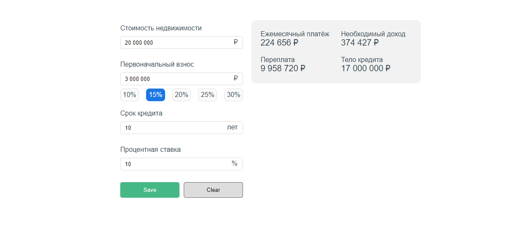

# [Ипотечный калькулятор](https://agants.github.io/mortgage/)

## Функциональность:
* Данные пересчитываться реактивно
* При нажатии на кнопку “Save” данные формы сохраняются
* При нажатии на кнопку “Clear” форма очищается
* Разряды чисел в полях формы и в результатах вычислений разделены пробелами
* При активации “процентного якоря” поля “стоимость недвижимости” и “первоначальный взнос” становятся связаны
